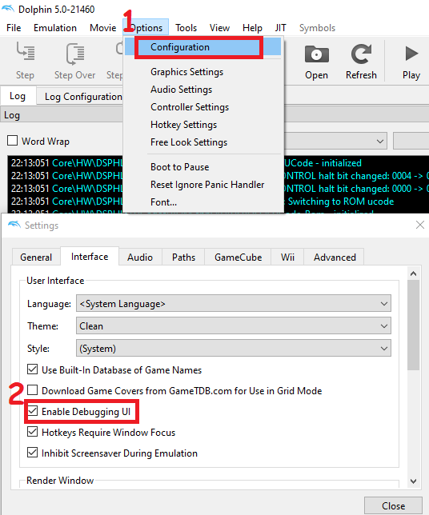
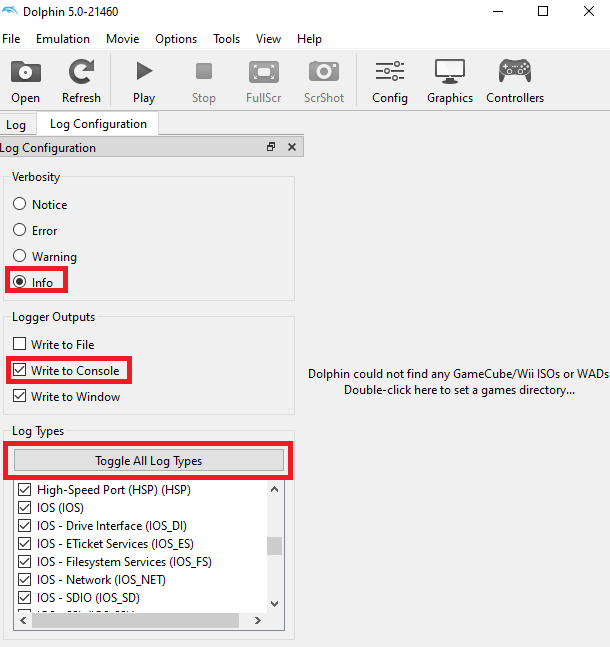

# Zig Wii SDK

This library provides build and runtime functions for running Zig applications on the Wii by utilizing the [devkitPro](https://devkitpro.org/wiki/About) toolchain.

## Requirements

* [devkitPro](https://devkitpro.org/wiki/Getting_Started)
* [Zig 0.13.x](https://ziglang.org/download/#release-0.13.0)

## How to use

See [example projects here](examples).

## Debugging in Dolphin

You'll want to enable the debugging UI in [Dolphin](https://dolphin-emu.org/). so that you can see printing from `std.debug.print` calls and make the log verbosity as high as possible.

## Credits

* [Knarkzel](https://github.com/knarkzel) for their initial work on compiling Zig for the Wii via their [zig-wii repositories](https://github.com/zig-wii/ogc/), that's what this was based off of.
